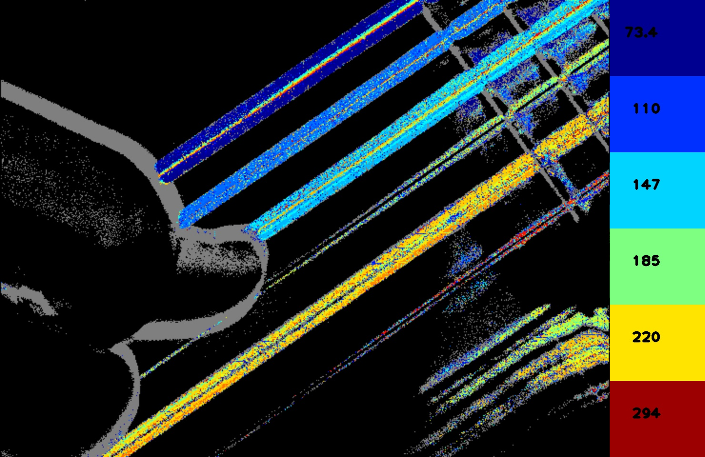
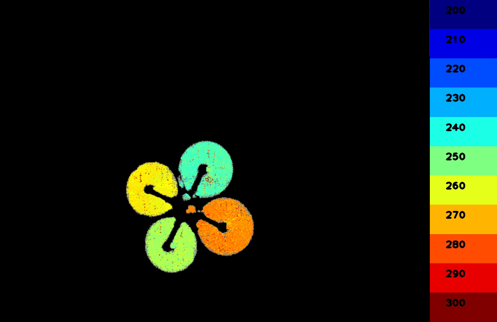
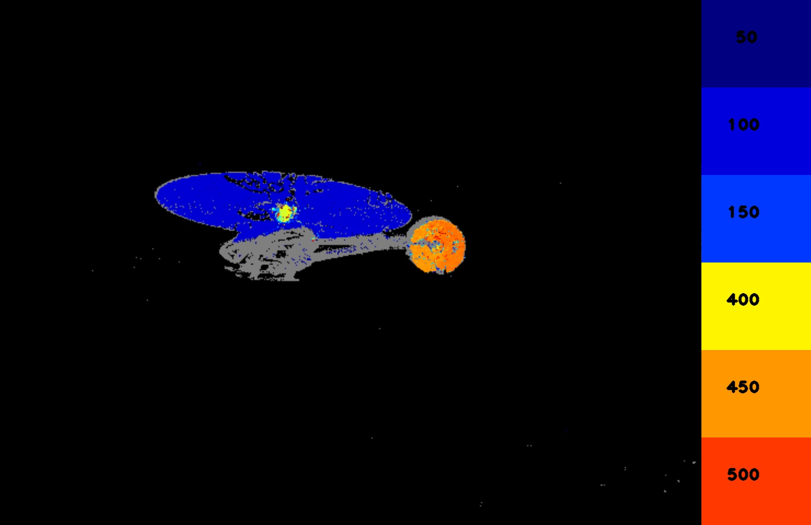

# FrequencyCam: Imaging Periodic Signals in Real-Time 

[](https://youtu.be/5oMtnrrNHu4)

This repository has a ROS/ROS2 node for frequency analysis with event
based cameras. FrequencyCam colors pixels in an image with the
frequency at which their brightness changes. The end result is a
"frequency image" that is very similar to Prophesee's
[Metavision Vibration Estimation module](https://docs.prophesee.ai/stable/metavision_sdk/modules/analytics/samples/vibration.html).

In contrast to the Metavision module, FrequencyCam is open source under
a permissive (Apache2 license) and is documented. It uses an IIR
digital filter to approximately reconstruct the brightness of each
pixel and then measures the time it takes between zero-level
crossings. For more details please
[refer to this paper](https://arxiv.org/abs/2211.00198).

Here are a few videos of FrequencyCam in action:

|guitar|quad rotor|heli|
|----|---|---|
|[](https://youtu.be/5oMtnrrNHu4)|[](https://youtu.be/1DOIe6SstFU)|[](https://youtu.be/KNoVoXxyzcI)|

## Supported platforms

Currently tested on Ubuntu 20.04 under ROS2 Galactic.

## How to build
Create a workspace (``~/ws``), clone this repo, and use ``vcs``
to pull in the remaining dependencies:
```
pkg=frequenc_cam
mkdir -p ~/${pkg}_ws/src
cd ~/${pkg}_ws
git clone https://github.com/berndpfrommer/${pkg}.git src/${pkg}
cd src
vcs import < ${pkg}/${pkg}.repos
cd ..
```

The build procedure is standard for ROS1 (catkin) and ROS2, so here is
only the ROS2 syntax:

```
cd ~/ws
colcon build --symlink-install --cmake-args -DCMAKE_BUILD_TYPE=RelWithDebInfo  # (optionally add -DCMAKE_EXPORT_COMPILE_COMMANDS=1)
```

## How to use

```
ros2 launch frequency_cam frequency_cam.launch.py
```
FrequencyCam expects ROS ``event_camera_msgs`` messages from the
[metavision ROS driver](https://github.com/ros-event-camera/metavision_driver)
here. You should be able to use other cameras (like DVS etc) by
converting the messages with a ``republish`` nodelet from the
[event camera tools](https://github.com/ros-event-camera/event_camera_tools)
repository. 

### Parameters (see launch file):

Input and algorithm related parameters:
- ``min_frequency``: lower bound for detected frequency
- ``max_frequency``: upper bound for detected frequency
- ``cutoff_period``: number of events to use for the filter, see
  paper. When in doubt set to 5.0 (default).
- ``num_timeout_cycles``: mark pixel inactive if it has not been
  updated for a time of ``num_timeout_cycles`` times pixel period
  (defaults to 2).
- ``use_sim_time``: set this to true when playing from bag (and play
  bag with ``--clock 10000``)
- ``bag_file``: only supported under ROS2: play from bag file and
  write generated frames to disk. If no bag file is given the node
  subscibes to topics.

Imaging related parameters:

- ``publishing_frequency``: frequency (in Hz) at which frequency image is
  published (defaults to 20Hz)
- ``use_log_frequency``: use log scale for frequency image coloring
- ``overlay_events``: mark pixels grey for which events have happened
  but no frequency could be found.
- ``legend_num_bins``: how many color patches to show (defaults to 11)
- ``legend_num_sig_digits``: how many significant digits to use for
  legend (defaults to 3).
- ``legend_frequencies``: explicitly specify frequencies of color patches to show in
  the legend.
- ``legend_width``: how many pixels wide the legend should be
  (defaults to 100).
- ``scale_image``: factor by how much to scale up the image in
  resolution. Only used when playing from bag under ROS2.
  Useful for getting nicer fonts for numbers when running
  from bag for movie generation.
  
### Topics

- ``~/image_raw``: topic under which frequency image is published.
- ``~/events``: event topic to subscribe to.


## License

This software is issued under the Apache License Version 2.0.
