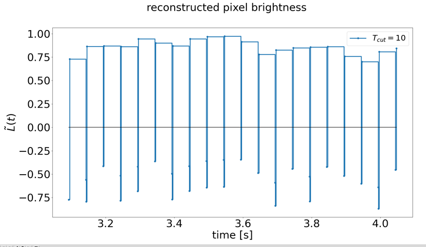
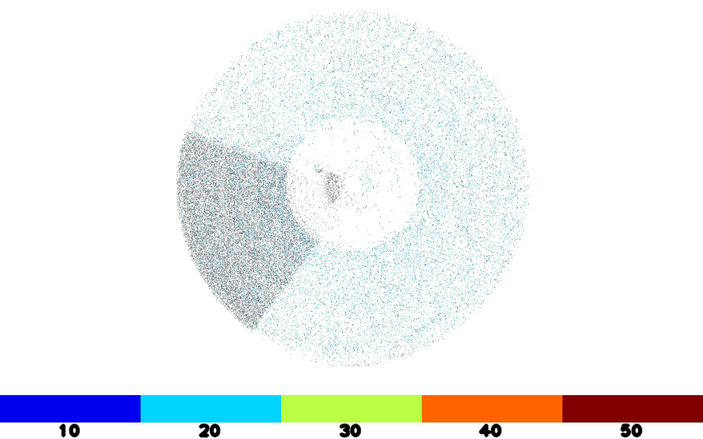

# Python code for experimentation

The code in this directory is for experimentation and not really supported.
It preceeded the implementation in C++, and was used for comparison with the
Metavision SDK's algorithms.


## How to use

### Plotting per-pixel data

It is often helpful to examine individual pixels, and see how the image reconstruction works.

```
python3 ./plot_pixels.py --filter --px 500 --py 360 --cutoff_period 10.0 --topic /event_camera/events -b /path_to_bag_file_with_events 
```

You can also plot naive integration by ommitting the ``--filter`` argument.



### Running the python version of frequency cam

The python code has not seen as much testing and debugging as the C++ code, please keep that in mind.

Here is an example of how to run frequency cam on a rosbag. You can use ``plot_pixels.py`` to check that your frequency range is about right.

```
python3 ./run_frequency_cam.py --bag /path_to_bag_file --freq_min 5.0 --freq_max 50.0 --labels 10.0 20.0 30.0 40.0 50.0

```

